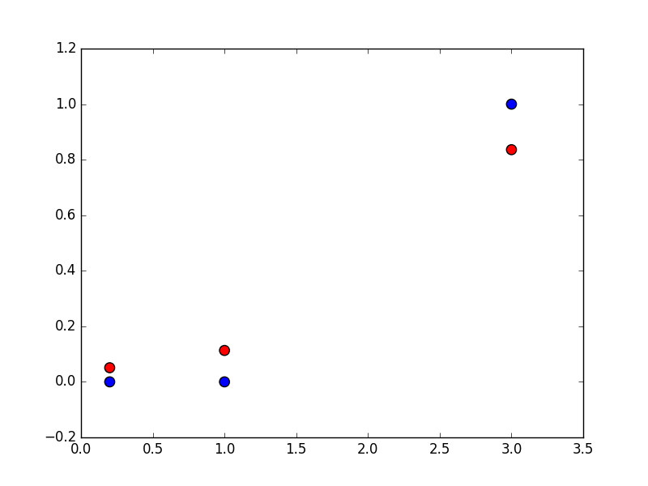

## Quiz: Softmax Part 2

### Notes

#### Scatterplots, using `matplotlib.scatter`

I took this as an opportunity to learn a little more about `matplotlib`. Though I could have simply printed the data out to the console, I decided to try plotting the data instead, this time with a scatterplot instead of a line plot.

After a bit of fiddling I got it working, but I'm not satisfied with my understanding of how best to use colors in `matplotlib`, so this bears additional investigation. In the plot below, the un-scaled input is red.



The final scatterplot is pretty much a complete failure as a useful visualization.

For one, it requires remembering which color corresponds to which set of input—something that can only be known by careful examination of the source code producing the plot.

For another, it doesn't directly show how the probability changes with the input magnitude at all (it had _one_ job...). Instead, the change must be inferred by visually comparing the relative distances for each pair of points, again having to remember which color represents the original value and which is the scaled value.

It will be useful to revisit the visualization of this data. Visualization is one of the most useful tools at our disposal, and it's nice to have a simple, well-constrained problem with which to experiment further.


#### `linspace` vs. `arange` in `numpy`

The boilerplate code given for [Quiz: Softmax][] uses `numpy.arange` to produce evenly spaced values within an interval:

```python
x = np.arange(-2.0, 6.0, 0.1)
```

The first two parameters are the endpoints of a half-open interval, and the third is the step size for the generated values. From the documentation:

> Values are generated within the half-open interval ``[start, stop)`` (in other words, the interval including `start` but excluding `stop`).

Because of this, using `arange` causes the plot lines to stop just short of the right edge. Here's the plot from [Quiz: Softmax][], which uses `arange` and a step size of `0.1`:


The effect is slight when the `step` size is small, but as the step size increases it becomes more noticeable. Here's the same plot, this time with a step size of `0.5`:


A similar function, `linspace`, also returns evenly spaced values over an interval, but with two key differences. First, the interval is open: both `start` and `stop` are included. Second, instead of a step size, its (optional) third argument is the number of samples to generate, with a default of `50`.

Drawing the plot again, this time using `linspace` with the default number of samples, yields:


Using `arange` and a step size of `0.1` generates 80 samples, versus the default of 50 for `linspace`. 50 samples is entirely sufficient for this particular plot—but for the sake of rigor, here it is one last time, using `linspace` with the number of samples set to `80` (the number `arange` would produce):


It's interesting that the course authors chose to use `arange` here, rather than another method of sample generation such as `linspace`. They both produce useful results in this case, and there may be good reasons to use `arange` that I'm simply not aware of yet.

Ultimately, I prefer the use of `linspace` here: that gap on the right edge of the plot just plain _bugs_ me.


### TODO

* Learn more about colors in `matplotlib`.
* Experiment with different visualization techniques.


### Resources

* [Quiz: Softmax][]
* [`matplotlib.scatter`](http://matplotlib.org/api/pyplot_api.html#matplotlib.pyplot.scatter)

[Quiz: Softmax]: ../quiz-softmax/
